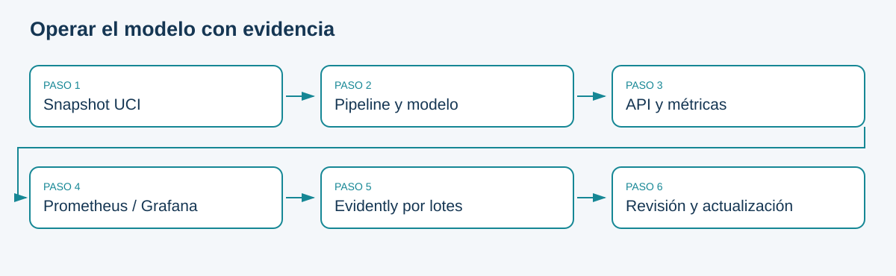

# Módulo 3. Operaciones, Monitoreo y Automatización Continua

Un modelo desplegado es una hipótesis que debe seguir contrastándose. Aunque la API responda, los datos pueden cambiar, las etiquetas pueden llegar tarde y el modelo puede dejar de ayudar a quienes lo utilizan. Este módulo enseña a reconocer esas situaciones, reunir evidencia y actualizar el sistema de forma controlada.

El recorrido integra **monitoreo y mantenimiento**, **CI/CD para ML** y **gobernanza, ética y escalabilidad**. Continúa las capacidades de empaquetado y despliegue del módulo 2 mediante un nuevo caso: clasificación de suscripción a depósitos con Bank Marketing de UCI.



## Cómo trabajar con el material

1. Lea los resultados y la guía de ambiente.
2. Recorra las unidades en orden: los controles de actualización dependen de entender las métricas.
3. Ejecute los seis notebooks y explique sus salidas con sus propias palabras.
4. Desarrolle la Actividad 3 en un equipo de tres personas.
5. Use la matriz de trazabilidad para comprobar la entrega.

El libro contiene el detalle técnico. Los documentos Word del material complementario, distribuidos por el docente, ofrecen el contenido esencial y las guías institucionales. El proyecto del estudiante está en `actividad_3/proyecto_inicial/`. La solución docente se distribuye por separado y no forma parte de este libro.

```{admonition} Qué significa producción en este laboratorio
:class: note
Se simula operación mediante una API local, tráfico HTTP y lotes de datos históricos. Ni los cambios artificiales ni los resultados del dataset demuestran desempeño en una institución financiera real.
```
