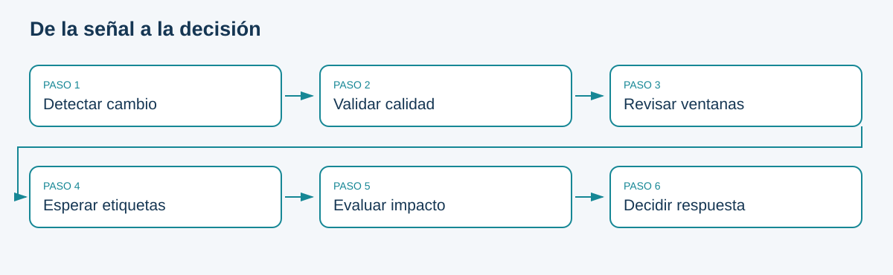

# Cambios en datos, predicciones y conceptos

## Objetivo
Identificar qué distribución cambió y qué se puede concluir con la evidencia disponible.

Un sistema aprende una aproximación a una relación entre entradas X y respuesta Y bajo ciertas condiciones. En operación cambian clientes, canales, reglas del negocio y mecanismos de captura. El término **model drift** suele usarse de forma amplia para hablar de degradación; en este libro se descompone para evitar diagnósticos ambiguos.

| Fenómeno | Cambio | Evidencia necesaria |
|---|---|---|
| Data drift | P(X) | Comparación de entradas entre ventanas |
| Prediction drift | P(Ŷ) | Distribución de scores o clases predichas |
| Concept drift | P(Y\|X) | Etiquetas y análisis de la relación, controlando otras causas |
| Cambio de prevalencia | P(Y) | Etiquetas observadas y política de muestreo |
| Degradación | Métrica empeora | Predicciones vinculadas a resultados reales |

Si aumenta el balance promedio, existe una señal sobre las entradas, pero el modelo podría seguir ordenando correctamente a los clientes. Si el proveedor invierte una codificación, el fallo puede ser calidad de datos y no un cambio natural de población. Si cambia la política comercial, una misma entrada puede relacionarse de otra manera con la suscripción.

```{mermaid}
flowchart LR
 A[Ventana actual] --> B{Calidad válida}
 B -->|No| C[Corregir captura]
 B -->|Sí| D[Comparar distribuciones]
 D --> E{Hay etiquetas}
 E -->|No| F[Investigar y esperar resultados]
 E -->|Sí| G[Evaluar desempeño y segmentos]
 G --> H[Decidir intervención]
```

## Experimento controlado

```python
from bank_ops.data import load, partitions
from bank_ops.monitor import scenario
_, validation, _ = partitions(load())
stable = validation.iloc[:1000].copy()
shifted = scenario(stable, "shift")
print(stable.balance.mean(), shifted.balance.mean())
assert stable.y.equals(shifted.y)
```

Aquí se modifican entradas sin cambiar etiquetas. El experimento no garantiza que el rendimiento se conserve: precisamente permite medir cómo reacciona el modelo. El escenario `degraded` hace lo contrario: mantiene X y altera artificialmente Y. Un detector de entradas puede no detectar esa intervención.

## Patrones temporales
Un cambio abrupto coincide con una nueva fuente o campaña; uno gradual puede aparecer por hábitos; uno recurrente puede ser estacional. Una única comparación no distingue bien esos patrones. Conservar series de ventanas y contexto operativo facilita no confundir estacionalidad con un incidente.

**Ejercicio:** describa dos situaciones donde haya drift sin degradación y una donde caiga el rendimiento sin cambiar las distribuciones marginales. Para cada una, indique qué dato le falta para tomar una decisión.

**Error frecuente:** ordenar reentrenamiento solo porque un p-valor sea pequeño. La acción debe considerar magnitud, impacto, calidad de etiquetas y costo del error.

## Esquema de consulta



Fuente: elaboración propia.

<!-- MANUAL AVANZADO -->

## Formalización: qué hipótesis estamos investigando

El punto de partida es una distribución conjunta $P_t(X,Y)$, donde $t$ identifica una población o periodo. Su factorización $P_t(X,Y)=P_t(Y\mid X)P_t(X)$ separa la composición de las entradas de la relación predictiva. No implica que sea posible estimar ambos factores con precisión en producción. Sin etiquetas recientes solo observamos parte del problema; con etiquetas seleccionadas observamos además el mecanismo que decidió qué casos recibirían una etiqueta.

Un cambio de covariables suele estudiarse bajo el supuesto de que cambia $P(X)$ y se conserva $P(Y\mid X)$. No basta encontrar diferencias en balance para verificar ese supuesto: demostrar estabilidad de la relación exigiría resultados y suficiente cobertura en las regiones nuevas. Un cambio de prevalencia describe $P(Y)$; el supuesto más fuerte conocido como label shift conserva $P(X\mid Y)$. No deben confundirse esas dos afirmaciones. El notebook usa perturbaciones deliberadas, no identifica retrospectivamente cuál mecanismo causal produjo los datos originales.

También es posible que cambien las predicciones porque se desplegó un modelo distinto, aunque las entradas sean idénticas. Por eso cada análisis debe fijar o registrar la versión del estimador, el preprocesamiento y el umbral. Comparar scores de dos versiones sin esa separación mezcla cambio de población con cambio de función. Una distribución de clases predichas añade otra dependencia: al mover el umbral puede cambiar drásticamente aunque los scores no cambien.

### Un contraejemplo multivariado

Considere dos variables binarias. En referencia aparecen por igual las parejas (0,0) y (1,1); en la ventana actual aparecen por igual (0,1) y (1,0). Cada columna conserva exactamente 50 % de ceros y 50 % de unos, pero la asociación se invierte. Un conjunto de pruebas independientes por columna no detectará esa modificación. Para un modelo que utiliza la interacción, la diferencia puede ser decisiva.

```python
# Ejemplo sintético autónomo: ejecutar en Python del proyecto.
import numpy as np
reference = np.array([[0, 0], [1, 1]] * 100)
current = np.array([[0, 1], [1, 0]] * 100)
assert np.array_equal(reference.mean(axis=0), current.mean(axis=0))
print(np.corrcoef(reference.T)[0, 1])  # 1.0
print(np.corrcoef(current.T)[0, 1])    # -1.0
```

El resultado motiva analizar asociaciones relevantes y segmentos, sin calcular indiscriminadamente todas las interacciones. Otra alternativa es entrenar un clasificador de dominio que intente distinguir referencia de actualidad. Su evaluación requiere separación de entrenamiento y validación, balance o control de los tamaños y exclusión de columnas que revelen artificialmente el origen, como un nombre de archivo. Una AUC alta demuestra separabilidad para ese clasificador; no demuestra deterioro del modelo de negocio ni explica automáticamente la causa.

## Elegir una medida según la pregunta

La estadística de Kolmogorov–Smirnov compara funciones de distribución empíricas: $D=\sup_x|F_n(x)-G_m(x)|$. Es adimensional y localiza la mayor separación acumulada. El p-valor contrasta una hipótesis de igualdad bajo supuestos de muestreo; no es la probabilidad de que exista drift ni una medida monetaria de impacto. En datos discretos con muchos empates, dependencia temporal o clientes repetidos, debe revisarse la calibración del contraste. [Referencia de KS en SciPy](https://docs.scipy.org/doc/scipy/reference/generated/scipy.stats.ks_2samp.html).

Wasserstein de orden uno, en una dimensión, puede interpretarse mediante $W_1=\int |F(x)-G(x)|\,dx$. Mantiene las unidades de la variable: un resultado para balance no se compara directamente con uno para número de contactos. En este libro usaremos también una versión descriptiva normalizada por el rango intercuartílico de la referencia; esa convención será explícita y no se confundirá con la normalización interna de Evidently. [Referencia de Wasserstein](https://docs.scipy.org/doc/scipy/reference/generated/scipy.stats.wasserstein_distance.html).

El PSI parte de proporciones en intervalos comunes: $\mathrm{PSI}=\sum_k(q_k-p_k)\log(q_k/p_k)$. Al fijar los intervalos con la referencia, ambos conjuntos responden a la misma discretización. Si se recalculan cuantiles por separado, dos distribuciones diferentes pueden aparentar ocupaciones iguales. Los ceros necesitan suavizado declarado; cambiar el suavizado o el número de intervalos modifica el resultado. Los umbrales populares de PSI no reemplazan una validación con el proceso concreto.

Para categorías, la distancia de variación total $\frac12\sum_k|p_k-q_k|$ resume redistribución de masa y está entre cero y uno. Las categorías nuevas deben incorporarse al soporte común. Un ejemplo con proporciones 80/20 frente a 50/50 produce 0.30: treinta puntos porcentuales de masa tendrían que redistribuirse. Esta interpretación suele comunicar mejor la magnitud que una etiqueta aislada de alerta.

## Magnitud, tamaño de muestra y decisiones repetidas

Suponga que un desplazamiento pequeño se observa en 100 registros y después en 100 000. La magnitud poblacional puede ser la misma, pero la incertidumbre se reduce con más datos y el contraste puede pasar de no rechazar a rechazar. La conclusión práctica debe incluir ambas cantidades: evidencia contra la igualdad y relevancia del cambio. Con pocas observaciones, no rechazar tampoco demuestra estabilidad.

Además, revisar muchas columnas y muchas ventanas aumenta las oportunidades de falsas alarmas. Para 20 pruebas independientes con nivel 0.05, la probabilidad de al menos un rechazo bajo todas las hipótesis nulas sería $1-0.95^{20}\approx0.64$. La independencia raramente se cumple exactamente, pero el cálculo muestra por qué una regla «cualquier p-valor pequeño» puede generar ruido. Control de falsos descubrimientos, persistencia, umbrales de efecto y priorización de variables responden a problemas distintos; no son sustitutos intercambiables.

La persistencia puede reducir alertas por oscilaciones breves, aunque también aumenta el tiempo de detección. Dos ventanas solapadas no son dos confirmaciones independientes. Para evaluar una política conviene simular o reproducir periodos estables y cambios relevantes, midiendo cuántas alertas genera, cuánto tarda y qué incidentes omite. Este análisis de política es diferente de escoger el detector con el score más llamativo.

## Investigación del escenario Bank Marketing

Desde `actividad_3/proyecto_inicial`, ejecutar los ejemplos con el entorno Poetry. El notebook 01 muestra medidas descriptivas; el 03 compara sensibilidad. La perturbación `shift` modifica simultáneamente balance y contact. Para atribuir una señal a cada intervención deben construirse controles separados: solo balance, solo contact y ambos. Mantener las mismas filas entre esos controles elimina una fuente de variación y facilita interpretar diferencias.

El escenario `degraded` invierte todas las etiquetas. Es una intervención extrema sobre la relación observada y también cambia la prevalencia; no representa una estimación realista de la frecuencia de incidentes. Una AP que aumente en ese escenario no contradice el deterioro de otras métricas: la base de comparación cambió. Un experimento más localizado podría invertir etiquetas en un segmento, pero exigiría declarar cuál y analizar denominadores suficientes.

Un diagnóstico útil termina con un registro concreto: ventana y tamaño, referencia, columnas afectadas, medida y umbral, versión del modelo, cobertura de etiquetas, hipótesis principal y comprobación siguiente. Si el canal de contacto cambia a `unknown`, se investigará la captura o integración antes de asumir que todos los clientes cambiaron de comportamiento. El mismo score puede justificar acciones distintas según su causa.

## Taller de razonamiento

Compare tres situaciones: cambio de moneda de balance sin conversión; nueva campaña dirigida a otro segmento; cambio de reglas para registrar una suscripción. Para cada una, identifique el contrato potencialmente roto, la distribución observable y la intervención inicial. No se exige reentrenar: una corrección de unidades puede ser la acción adecuada.

```{admonition} Pista de interpretación
:class: dropdown
La primera situación puede ser un error semántico aunque todos los valores sean numéricos. La segunda puede ser un cambio válido de población. La tercera puede alterar la definición de Y, por lo que comparar métricas sin revisar etiquetas sería engañoso. Un detector estadístico no separa esas explicaciones por sí solo.
```

Antes de seguir, formule una conclusión que incluya una incertidumbre: «observamos un cambio en la distribución de balance, medido con una distancia en las mismas unidades; todavía no conocemos su impacto porque las etiquetas maduras cubren solo una parte de los casos». Esa redacción convierte el monitoreo en una pregunta verificable y evita prometer una respuesta que los datos disponibles no permiten.
