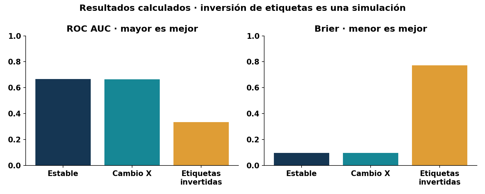

# Seguimiento del desempeño en producción

## Tres capas de medición

La infraestructura informa si el servicio responde: disponibilidad, latencia, errores y saturación. Las métricas del modelo evalúan su capacidad predictiva: discriminación, calibración y errores por clase. Las del proceso miden impacto: contactos útiles, tiempos y costos. Ninguna capa reemplaza a las otras: una API rápida puede servir un modelo inútil.

En clasificación desbalanceada la accuracy puede ser alta prediciendo siempre la clase mayoritaria. La precisión positiva es TP/(TP+FP); el recall es TP/(TP+FN). F1 resume ambas, pero oculta sus costos. ROC AUC mide ordenamiento entre positivos y negativos; average precision (AP) resume precisión-recall a distintos umbrales y debe interpretarse junto a la prevalencia. Brier es el promedio de (p−y)²: menor es mejor y evalúa probabilidades.



El umbral 0.25 es una política educativa fija. No significa que 0.25 sea óptimo para una campaña real. Elegirlo requeriría costos de contacto, capacidad y consecuencias para los grupos. Cambiar el umbral también es un cambio del sistema y debe versionarse.

## Etiquetas tardías

Una predicción se registra con `prediction_id`, instante y versión. Cuando llega su resultado se une por identificador, no por orden de fila. La cobertura de etiquetas es observadas/emitidas; si solo llegan resultados de ciertos casos, la evaluación puede estar sesgada.

```python
import pandas as pd
from bank_ops.monitor import delayed_performance
pred = pd.DataFrame({"prediction_id":["a","b","c"],
    "probability":[.8,.1,.4], "model_version":["v1","v1","v1"]})
labels = pd.DataFrame({"prediction_id":["a","b"], "target":[1,0]})
print(delayed_performance(pred, labels))
```

El tercer registro no es un negativo: es un caso sin resultado. La función conserva el denominador de cobertura, rechaza identificadores duplicados y separa versiones. Si una ventana contiene una sola clase, AUC no está definida y se devuelve `None`; no se inventa cero.

## Ventanas y objetivos
Un objetivo didáctico puede exigir p95 menor de 500 ms y readiness disponible durante una prueba. En producción se debe fijar población, periodo, exclusiones y presupuesto de error. Medir p95 sobre tres peticiones no demuestra capacidad. Tampoco comparar métricas de dos ventanas con prevalencias muy distintas prueba que el cambio se deba al modelo.

**Ejercicio:** una ventana tiene AP menor pero mayor prevalencia, y solo 40 % de etiquetas. Redacte qué investigaría antes de declarar un incidente del modelo.
