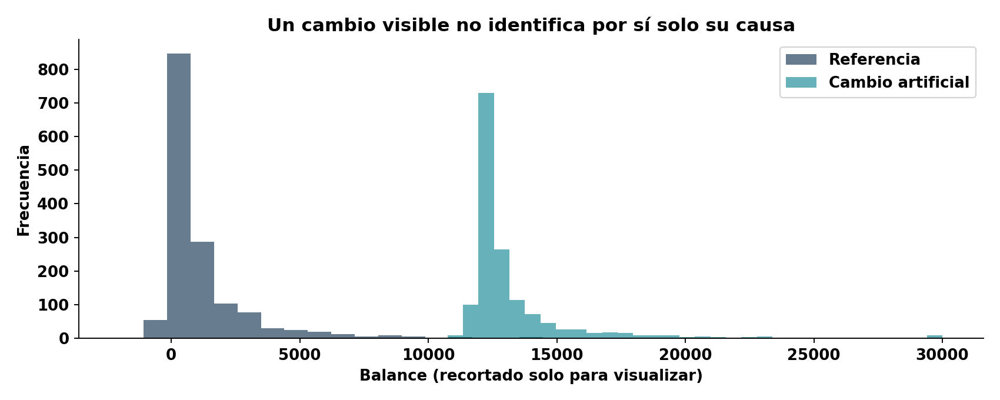

# Referencias, umbrales y calidad de datos

## Diseñar una comparación válida

La referencia es una población de comparación, no necesariamente todos los datos de entrenamiento. Puede ser validación aceptada, un periodo operativo estable o una ventana móvil. Una referencia fija revela desviaciones acumuladas; una móvil se adapta a estacionalidad, pero puede normalizar lentamente un deterioro. Versionar la referencia, tamaño, selección de columnas y fecha de aprobación.

Antes de medir drift hay que verificar esquema, nulos, dominios, rangos y volumen. Una columna llena de nulos o un lote vacío no es una evidencia estadística utilizable. Los duplicados requieren reglas de negocio: dos filas idénticas pueden ser contactos distintos. Sin identificador no se deben borrar automáticamente.

```python
from bank_ops.data import validate
validate(stable)
invalid = stable.copy()
invalid.loc[invalid.index[0], "campaign"] = -3
try:
    validate(invalid)
except ValueError as error:
    print("Lote rechazado:", error)
```

## Métodos y cautelas

Una prueba KS compara funciones de distribución acumulada de una variable continua. Un p-valor es evidencia contra una hipótesis nula bajo supuestos, no el tamaño del cambio. Con muchas filas pueden resultar significativos cambios pequeños. La distancia de Wasserstein mide desplazamiento y depende de las unidades. Para categorías se pueden comparar proporciones; categorías raras y nuevos niveles merecen atención.

PSI resume cambios entre histogramas mediante Σ(actual−referencia)·log(actual/referencia). Depende de los bins y necesita tratamiento de ceros. Sus umbrales populares no son leyes universales. Evaluar múltiples columnas aumenta la probabilidad de falsas alertas; inspeccionar persistencia, importancia, tamaño del cambio y contexto.



## Política operativa didáctica
Separar alertas informativas de incidentes. Una violación de contrato rechaza el lote. Un cambio de distribución abre investigación. Una degradación sostenida con suficientes etiquetas activa comparación de candidatos. El laboratorio guarda reportes de Evidently; no conecta automáticamente toda señal de drift con una promoción.

Para diseñar umbrales, repetir ventanas estables, medir falsos positivos y simular cambios conocidos. Documentar tamaño mínimo y tiempo de persistencia. El módulo usa controles estables de una misma ventana para aislar ese experimento y mantiene la evaluación histórica final separada.

**Ejercicio:** comparar una muestra de 100 filas y otra de 1500. Explicar por qué una conclusión puede cambiar sin que la diferencia de medias cambie sustancialmente.
