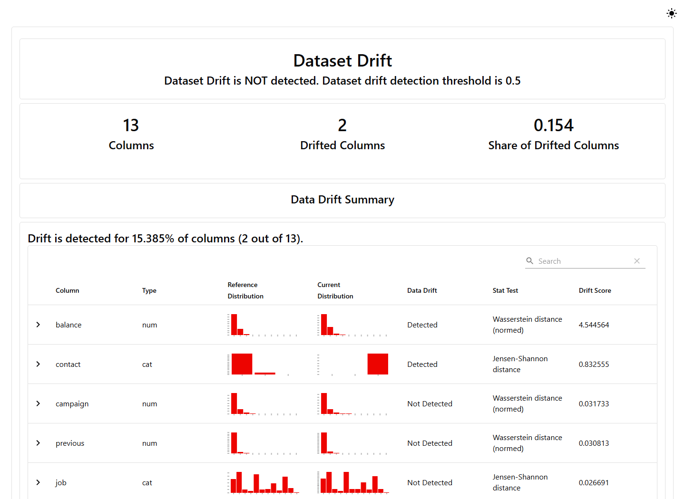

# Evidently: del DataFrame al informe

## Preparar el reporte

Evidently compara datasets y genera evidencia exportable. Se fija la versión usada en el proyecto: ejemplos de APIs antiguas no deben mezclarse con la interfaz `Dataset`, `DataDefinition` y `Report` utilizada aquí.

```python
from evidently import Dataset, DataDefinition, Report
from evidently.presets import DataDriftPreset
from bank_ops.config import NUMERIC, CATEGORICAL, FEATURES

definition = DataDefinition(numerical_columns=NUMERIC,
                            categorical_columns=CATEGORICAL)
reference = Dataset.from_pandas(stable[FEATURES], data_definition=definition)
current = Dataset.from_pandas(shifted[FEATURES], data_definition=definition)
snapshot = Report([DataDriftPreset()]).run(
    reference_data=reference, current_data=current)
snapshot.save_html("drift.html")
snapshot.save_json("drift.json")
```

El HTML permite explorar las distribuciones y resultados; JSON facilita conservación y procesamiento. Revisar el método y umbral que el reporte asigna a cada columna: las selecciones predeterminadas pueden depender de tipo y tamaño. Para una política estable hay que fijar y documentar la configuración, no depender silenciosamente de cambios de versión.

## Lectura del informe
Comenzar por tamaños de las ventanas y calidad de columnas; luego inspeccionar qué variables cambiaron y en qué dirección. Vincular el cambio con el contexto: una columna `contact` dominada por `unknown` podría ser una modificación del canal o una falla del extractor. El reporte identifica la diferencia; la causa necesita investigación.

El proyecto crea informes `drift_stable`, `drift_shift` y `drift_degraded`. En el último, las entradas son idénticas al control estable y se modifican etiquetas fuera de las columnas analizadas. Su utilidad es demostrar una limitación: detectar drift en X no basta para monitorear calidad predictiva.

## Integración por lotes
Ejecutar el reporte después de validar el lote y antes de decidir su uso. Guardar ventana, modelo, referencia, versión de herramienta y resultados. No generar un reporte completo en cada llamada HTTP: aumenta latencia y mezcla observabilidad con inferencia. En este laboratorio el comando `monitor` trabaja fuera de la API.

**Práctica:** abra los tres HTML, seleccione una variable numérica y una categórica, compare distribuciones y escriba una hipótesis contrastable. Cite el reporte concreto, no solo una captura.

**Consulta:** [interfaz de la biblioteca](https://docs.evidentlyai.com/docs/library/overview) y [preset de drift](https://docs.evidentlyai.com/metrics/preset_data_drift).

## Captura del reporte ejecutado



Fuente: captura de la ejecución del laboratorio. Se detectan cambios en 2 de 13 columnas (15.4 %). El encabezado global indica que no se supera su regla agregada de 50 %. No hay contradicción: la señal por columna y la decisión agregada son distintas. Una variable importante puede requerir investigación aunque el indicador global no se active. No ajustar el umbral solamente para obtener un aviso rojo.

<!-- MANUAL AVANZADO -->

## Separar medición, reporte y política

Un reporte de drift responde qué diferencias encuentra un conjunto de métodos entre dos datasets. La política operativa añade qué diferencias importan, quién las revisa y qué acción corresponde. Mezclar esos niveles hace que un cambio de versión de la biblioteca pueda modificar decisiones sin revisión consciente. En el proyecto, `drift_report` produce HTML y JSON; no promueve modelos ni decide por sí mismo que el servicio deba detenerse.

Evidently 0.7.20 está fijado en las dependencias. El ejemplo utiliza `Dataset`, `DataDefinition`, `Report` y `DataDriftPreset`. La documentación actual puede mostrar APIs posteriores o ejemplos de otras familias de evaluación. Antes de copiar un fragmento, comprobar la versión y el tipo de objeto devuelto. La compatibilidad se verifica ejecutando el entorno fijado, no suponiendo que dos clases con nombres parecidos comparten métodos.

La declaración de columnas importa porque una variable numérica de baja cardinalidad puede representar una categoría. La codificación de un canal como 0, 1 y 2 no implica que la distancia entre canales tenga significado cuantitativo. En Bank Marketing se separan cuatro variables numéricas de nueve categóricas, y las columnas usadas para auditar grupos o identificar resultados se mantienen fuera del conjunto de features del modelo.

## Recorrido del código y sus fronteras

Ejecutar desde `actividad_3/proyecto_inicial`, con las dependencias de Poetry instaladas. Este ejemplo crea un reporte adicional en `reports/`, sin entrenar ni modificar el registro de modelos:

```python
from bank_ops.data import load, partitions
from bank_ops.monitor import drift_report, scenario
_, validation, _ = partitions(load())
pool = validation.sample(frac=1, random_state=42)
reference = pool.iloc[:1500].copy()
current = pool.iloc[1500:3000].copy()
result = drift_report(reference, scenario(current, "shift"), "taller")
print(type(result).__name__)
```

Primero se valida el contrato de ambos DataFrames. Luego se seleccionan las features y se declaran los tipos. Finalmente se ejecuta el reporte y se guardan sus representaciones. La separación permite detectar una falla de calidad antes de intentar interpretar una distancia. Si `campaign` contiene un valor negativo, no tiene sentido presentar esa ventana simplemente como otra población válida del mismo proceso.

El muestreo anterior construye un control educativo dentro de validation. Los grupos no comparten filas, pero proceden del mismo conjunto histórico y no prueban independencia temporal o por persona. La semilla facilita reproducir la selección; no corrige esas limitaciones. El notebook 03 añade perturbaciones y tamaños de muestra para estudiar cómo responde el análisis, manteniendo test fuera de la selección de políticas.

### Inspeccionar el JSON sin acoplarse a posiciones accidentales

El HTML es útil para explorar; el JSON permite conservar resultados y revisar diferencias. No conviene asumir que la primera entrada de una lista siempre corresponde a balance, ni buscar una palabra en el HTML para decidir si se bloquea una actualización. Una integración estable identifica métricas por su significado, valida la estructura esperada y falla explícitamente si una actualización de biblioteca cambia ese contrato.

```python
# Ejecutar después del ejemplo anterior, desde el mismo directorio.
import json
from pathlib import Path
payload = json.loads(Path("reports/drift_taller.json").read_text(encoding="utf-8"))
print(type(payload).__name__)
if isinstance(payload, dict):
    print(sorted(payload.keys()))
```

Este fragmento inspecciona la estructura realmente generada; no inventa un campo universal llamado `drift_detected`. Para un pipeline productivo se escribiría un adaptador específico de versión, acompañado de un fixture pequeño que verifique la extracción de columnas, métodos, scores y umbrales. El material conserva el reporte íntegro como evidencia y discute la política por separado.

## Por qué un score necesita nombre y dirección

Un p-valor pequeño y una distancia grande pueden indicar cambio, pero sus direcciones son opuestas. Una regla genérica «score mayor que 0.1» sería incorrecta si el método devuelve p-valores. El reporte debe leerse con nombre del método, tipo de variable y umbral. La selección automática de método puede depender del volumen y cardinalidad; para comparar series históricas se debe registrar esa selección o fijar una configuración validada. [Explicación oficial del algoritmo de drift](https://docs.evidentlyai.com/metrics/explainer_drift).

En el caso incluido, una señal en dos de trece columnas representa aproximadamente 15.4 % de las features. Si una agregación exige 50 %, puede informar que no hay drift global aunque balance y contact sí muestren cambio. No es una contradicción matemática: son dos preguntas. La regla global trata columnas como unidades de conteo, pero una sola variable crítica puede importar más que varias variables secundarias.

Una política más informativa puede combinar tres criterios: cambios de contrato con respuesta inmediata, cambios relevantes en variables críticas con investigación y un agregado para describir extensión. Esos criterios no necesitan compartir umbral ni severidad. Deben evitarse pesos retrospectivos elegidos solo para hacer coincidir la alarma con un caso que ya se conoce.

## Comparaciones que conviene ejecutar

El control estable permite observar diferencias de muestreo. El desplazamiento solo de balance estudia una variable cuantitativa; el cambio solo de contact estudia mezcla categórica; el escenario conjunto muestra la agregación. La inversión de etiquetas conserva exactamente las entradas, por lo que un reporte que recibe únicamente features no tiene información para detectar esa intervención. Ese resultado valida el alcance del detector, no un defecto de ejecución.

El tamaño de muestra puede modificar sensibilidad y selección automática. Para aislar el efecto estadístico, el notebook compara también medidas explícitas de SciPy sobre una simulación con desplazamiento conocido. Se conserva el nombre de la medida y no se equipara su distancia bruta con el score normalizado de otra implementación. Dos herramientas pueden utilizar la misma familia matemática y aun así producir escalas diferentes.

Una comprobación adicional consiste en degradar calidad sin alterar mucho la media: introducir valores ausentes, cambiar unidades en un subconjunto o sustituir categorías por un marcador genérico. La media puede permanecer parecida mientras se pierde información útil. Un preset de drift no reemplaza controles de nulos, unicidad, disponibilidad temporal y rangos. En este proyecto, algunas de esas intervenciones se rechazan antes del reporte.

## Operación por lotes y presupuesto de observabilidad

Generar reportes completos en cada solicitud aumentaría latencia y duplicaría trabajo. El servicio registra evidencia mínima y un proceso separado analiza lotes. Esta arquitectura introduce un retraso de detección que debe incluirse en el diseño: frecuencia de lote más duración del cálculo más tiempo de revisión. No se puede prometer respuesta inmediata con reportes ejecutados una vez al día.

La retención puede separar el reporte completo del resumen de seguimiento. Un informe HTML por cada pequeña ventana puede consumir almacenamiento y dificultar encontrar incidentes. Una convención de nombres con fecha de corte, versión del modelo y referencia evita sobreescrituras. El ejemplo docente utiliza nombres fijos por escenario; antes de repetir, copie los archivos que necesite conservar. Esa simplificación no se presenta como un almacén histórico completo.

Para datos sensibles, revisar qué información expone el reporte y quién puede acceder. Que la API no registre atributos personales no significa que un HTML generado sobre datos individuales sea automáticamente publicable. En este libro se distribuyen imágenes y datos educativos con procedencia; el patrón industrial requiere controles de acceso y minimización acordes con sus propios datos.

## Runbook para un reporte inesperado

Si el reporte falla, verificar contrato y columnas antes de modificar parámetros. Si se genera pero parece vacío, comprobar que la ventana tiene filas, que la selección de features corresponde a la definición y que se abrió el archivo de la ejecución reciente. Si marca muchas columnas simultáneamente, investigar cambios comunes de extracción, filtros o referencia antes de proponer múltiples incidentes independientes.

Si solo una feature cambia, revisar su distribución completa y segmentos relevantes. Un desplazamiento de mediana y un pequeño conjunto de extremos pueden producir distancias parecidas y exigir respuestas distintas. La inspección visual complementa el score; tampoco debe utilizarse como sustituto de una definición reproducible de la alarma.

```{admonition} Ejercicio y criterio de revisión
:class: dropdown
Construya una tabla con escenario, número de filas, columnas alteradas deliberadamente, método observado y conclusión permitida. Para el escenario de etiquetas invertidas, la conclusión correcta es que el reporte de entradas no evalúa el cambio de Y. Para el control estable, una diferencia pequeña no demuestra identidad perfecta. La respuesta debe explicar el alcance, no solo copiar el color del reporte.
```

Continúe con [Prometheus](05_prometheus.md) para distinguir esta evaluación por lotes de la observación del servicio. Un sistema puede tener reportes de datos correctos y estar caído; también puede responder rápidamente mientras su calidad predictiva se deteriora. Ambas dimensiones necesitan evidencia propia.
