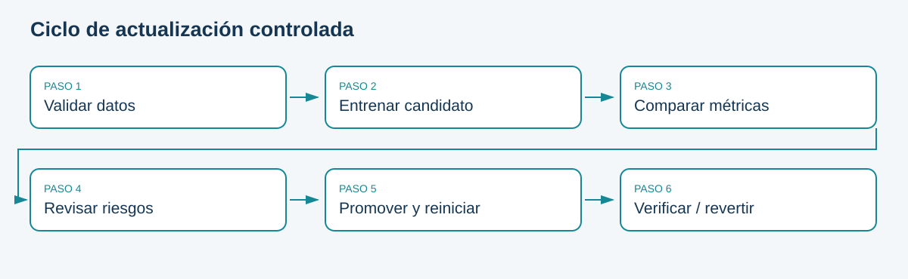

# Retraining programado y activado por evidencia

## Entrenar de nuevo no garantiza mejorar

Un calendario facilita mantenimiento, pero puede desperdiciar recursos si no llegan datos nuevos. Un trigger por drift puede reaccionar a datos defectuosos. Separar generación de candidato de decisión de despliegue permite automatizar trabajo sin entregar el control a una señal aislada.

El workflow semanal del laboratorio reentrena sobre el snapshot fijo: demuestra orquestación reproducible, no aprendizaje con nueva información. Para un sistema real habría que incorporar un snapshot nuevo, validar etiquetas, versionarlo y definir una ventana de entrenamiento. No usar la partición de prueba histórica repetidamente para optimizar candidatos.

```{mermaid}
flowchart LR
 A[Calendario o solicitud] --> B[Validar snapshot]
 B --> C[Entrenar candidato]
 C --> D[Comparar en validación]
 D --> E{Cumple controles}
 E -->|No| F[Conservar vigente]
 E -->|Sí| G[Revisión humana]
 G --> H[Promoción local]
 H --> I[Verificación y seguimiento]
```

## Comandos independientes

```powershell
poetry run python -m bank_ops.cli train --version candidate-v2 --kind candidate
poetry run python -m bank_ops.cli compare --candidate candidate-v2 --incumbent baseline-v1
```

Cada versión tiene su carpeta; repetir un nombre falla de forma explícita. Esta política evita sobrescribir evidencias. El workflow usa un runner limpio y conserva artefactos con el identificador de ejecución. El registro local está diseñado para un operador; coordinar escritores concurrentes requeriría bloqueo o una base transaccional.

## Datos y etiquetas
Antes de reentrenar, preguntar: ¿las etiquetas ya maduraron?, ¿cambió su definición?, ¿hay suficientes positivos?, ¿se introdujo sesgo de selección? Si solo se etiqueta a quienes el modelo decidió contactar, el próximo entrenamiento puede reforzar sus exclusiones. La automatización debe conservar esa advertencia en la evaluación.

**Práctica:** ejecute baseline y candidato, registre tiempo, métricas y tamaño. Escriba por qué un entrenamiento más costoso podría no justificar una actualización.

## Esquema de consulta



Fuente: elaboración propia.

<!-- MANUAL AVANZADO -->

## Definir qué se actualiza y por qué

Reentrenar significa estimar de nuevo parámetros a partir de datos y una configuración. Actualizar un sistema puede incluir además cambiar features, preprocesamiento, umbral, calibración, dependencias o contrato de entrada. Cada modificación introduce riesgos distintos. Si cambia el significado de una variable, entrenar con el mismo nombre de columna no garantiza compatibilidad; si solo cambia el umbral, no hace falta fingir que se aprendió un nuevo modelo.

El retraining completo vuelve a ajustar el pipeline desde cero. Un entrenamiento incremental conserva un estado previo y lo modifica con nuevos lotes, siempre que el estimador y las transformaciones lo soporten. La implementación del proyecto realiza entrenamiento completo; llamar `train` repetidamente no utiliza aprendizaje incremental. Un bosque o un scaler no adquiere esa propiedad simplemente porque un workflow se ejecute cada semana.

El motivo de una ejecución debería poder expresarse antes de observar al candidato: llegaron etiquetas maduras, existe un cambio confirmado de población, venció un periodo de revisión o se necesita corregir una versión defectuosa. «Porque el calendario lo permite» puede justificar producir evidencia periódica, pero no aprobar automáticamente el resultado. El costo de entrenar y el riesgo de reemplazar son decisiones separadas.

## Políticas de disparo y sus costos

Una política por calendario ofrece previsibilidad y facilita reservar recursos. Puede ejecutar trabajo redundante si no cambian los datos. Una política por evento reacciona a nueva información, pero exige definir qué evento es suficiente y cómo evitar ejecuciones duplicadas. Una política híbrida establece revisiones periódicas y permite ejecuciones extraordinarias justificadas. Para el caso docente se mantiene la agenda semanal y la ejecución manual, sin conectar directamente una alarma de drift al despliegue.

Un evento de llegada de datos no garantiza que esos datos sean utilizables. Deben cumplirse esquema, calidad, versión de etiquetas y maduración. Si llegan 10 000 registros sin resultados, el entrenamiento supervisado no dispone de 10 000 ejemplos nuevos completos. Si los resultados se corrigen posteriormente, conviene conservar la versión de etiquetas y decidir si esa corrección requiere un nuevo candidato.

El control de duplicados puede apoyarse en una clave de trabajo que identifique snapshot y configuración. Si ya existe una ejecución terminada para esa combinación, puede reutilizarse su evidencia o registrar una reproducción deliberada. El registro docente rechaza nombres de versión existentes, pero no implementa deduplicación semántica por contenido. Dos nombres distintos pueden contener modelos equivalentes; la réplica del baseline utiliza justamente esa posibilidad para ensayar el mecanismo.

## Construcción del conjunto de entrenamiento

Una ventana expansiva conserva historia y aumenta volumen, pero puede dar peso excesivo a regímenes antiguos. Una ventana reciente adapta más rápido y reduce costo, pero puede olvidar segmentos raros y variaciones estacionales. Una mezcla ponderada permite equilibrar antigüedad y cobertura, aunque sus pesos deben justificarse y validarse. Ninguna estrategia es universalmente mejor; la elección depende del horizonte de cambios y de la disponibilidad de resultados confiables.

Antes de comparar esas estrategias hay que evitar contaminación entre train, validation y test. Los transformadores se ajustan exclusivamente con train, y las decisiones de selección se toman en validation. Un pipeline ayuda a conservar ese flujo cuando se usa correctamente, pero no impide que el usuario le entregue todas las filas durante `fit`. La prevención de fugas es una propiedad del procedimiento completo. [Errores frecuentes y pipelines en scikit-learn](https://scikit-learn.org/1.6/common_pitfalls.html).

Bank Marketing se divide conservando orden en 60/20/20. Esa decisión evita barajar arbitrariamente antes de estudiar cambios, pero no demuestra un backtest temporal estricto: no hay fecha completa ni identificador de persona para verificar todas las dependencias. No se deben fabricar timestamps para afirmar lo contrario. Los experimentos de maduración del notebook son simulaciones rotuladas como tales.

### Lista de entrada al entrenamiento

| Evidencia | Comprobación | Si no se cumple |
|---|---|---|
| Identidad del snapshot | Huella y procedencia registradas | Detener y revisar origen |
| Semántica de etiquetas | Definición consistente y fecha de corte | Aclarar o versionar la definición |
| Cobertura | Casos y clases suficientes | Esperar o limitar la conclusión |
| Disponibilidad de features | Información conocida al predecir | Excluir o rediseñar variables |
| Particiones | Separación y ausencia de ajuste con test | Reconstruir evaluación |
| Presupuesto | Tiempo y recursos disponibles | Reprogramar o reducir experimento |

La tabla no exige infraestructura adicional; obliga a que cada «sí» tenga una evidencia. El snapshot local y el lock del proyecto resuelven parte de la identificación, mientras que maduración y representatividad siguen limitadas por el caso histórico.

## Un entrenamiento observable

La ejecución debe registrar inicio, fin, estado, datos, configuración, versión de código y resultado. Un error de descarga, un fallo de validación y un entrenamiento que produce peor modelo no son el mismo estado. El primero puede ser un incidente de infraestructura; el segundo protege el contrato; el tercero puede ser un resultado científico válido. Si todos se codifican como «falló ML», se pierde la capacidad de decidir qué repetir.

Durante un entrenamiento largo conviene conocer progreso y consumo, sin llenar logs con cada fila. El ejemplo usa un dataset pequeño y una llamada síncrona. El tiempo medido con `perf_counter` representa duración en esa máquina y bajo esa carga; una comparación de costos entre algoritmos necesita repetir o controlar condiciones. Los notebooks conservan semillas y límites de tamaño para que la profundización siga siendo local.

```python
# Ejecutar desde proyecto_inicial. No escribe artefactos de producción.
from time import perf_counter
from bank_ops.data import load, partitions
from bank_ops.config import FEATURES
from bank_ops.model import pipeline, metrics
train_df, val, _ = partitions(load())
started = perf_counter()
candidate = pipeline("candidate")
candidate.fit(train_df[FEATURES], (train_df.y == "yes").astype(int))
elapsed = perf_counter() - started
score = metrics((val.y == "yes").astype(int),
                candidate.predict_proba(val[FEATURES])[:, 1])
print({"seconds": elapsed, "validation": score})
```

El bloque mide un candidato en memoria. No modifica `current.json`, no reinicia la API y no demuestra despliegue. Esa separación permite experimentar sin efectos sobre el servicio local. El notebook 06 desarrolla la comparación y la incertidumbre; la implementación del gate obligatorio sigue siendo una tarea del equipo.

## Reintentos, concurrencia y publicación de resultados

Un reintento es seguro solo si se entiende qué estado quedó escrito. Si falló antes de crear artefactos, puede ser suficiente repetir. Si dejó una carpeta parcial, una nueva ejecución con el mismo nombre será rechazada por la política de inmutabilidad del proyecto. El operador debe inspeccionar y documentar el estado; borrar carpetas automáticamente podría eliminar evidencia útil. Una implementación industrial escribiría resultados en un área temporal y publicaría la versión solo después de validar su completitud.

Dos entrenamientos pueden ejecutarse en paralelo sin que ambos deban promover. El punto crítico es decidir cuál versión vigente se usa para comparar y asegurar que no cambió entre evaluación y aprobación. El ejemplo tiene un solo operador y el workflow programado evita solapar su grupo de concurrencia, pero no coordina otros procesos externos. Ampliar concurrencia requiere controles en el registro, no solo un parámetro del scheduler.

El workflow del starter genera baseline y candidato en un runner limpio. Su `compare` todavía contiene A3-01, por lo que la ejecución de retraining no completará la comparación hasta implementar esa tarea. Un resultado rojo en ese estado no contradice la existencia del flujo; muestra que se trata de un proyecto inicial. Después de completarlo, un candidato no elegible debe producir evidencia interpretable de rechazo, sin promoverlo.

## Revisión posterior al entrenamiento

La ficha del candidato debe indicar qué cambió respecto del vigente, si hay datos nuevos, qué métricas se compararon y qué incertidumbres permanecen. Reentrenar semanalmente sobre el mismo snapshot y la misma semilla puede reproducir el baseline. Ese resultado verifica la automatización, pero no sostiene una afirmación de adaptación al mundo reciente.

```{admonition} Caso de decisión
:class: dropdown
El candidato mejora AP en 0.001, duplica tamaño y triplica tiempo de entrenamiento. ¿Debe reemplazar al vigente? La mejora puntual no basta. Revisar incertidumbre, desempeño en el punto de decisión, latencia, capacidad, grupos y costo. Mantener el modelo actual puede ser la decisión correcta; el esfuerzo de entrenar no crea una obligación de desplegar.
```

La conclusión del capítulo es un contrato operativo: el entrenamiento produce candidatos y evidencia; la aprobación evalúa si esa evidencia justifica cambiar el sistema. Mantener la frontera permite automatizar con mayor frecuencia sin reducir el rigor de las decisiones.
