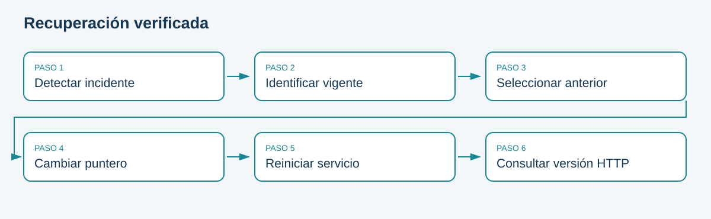

# Comparación, promoción y rollback

## Política explícita de aceptación

La solución calcula nuevamente las métricas de ambos artefactos sobre la misma validación. No confía únicamente en un JSON con métricas declaradas. El candidato es elegible si AP no cae más de 0.005, recall no cae más de 0.02 y Brier no empeora más de 0.01. Son tolerancias docentes, no límites universales.

Elegibilidad técnica no equivale a aprobación integral. El operador revisa además equidad, latencia, compatibilidad y contexto, y registra responsable y justificación. Los controles estadísticos no sustituyen esa revisión. Si falla el gate, la función de promoción conserva el puntero vigente.

## Puntero y proceso
`current.json` referencia una versión inmutable. La escritura temporal y reemplazo reducen el riesgo de un archivo parcialmente escrito. El registro de auditoría conserva la acción; no es una transacción distribuida ni un log inviolable. La API carga una vez al iniciar, por lo que después de cambiar el puntero se reinicia y se comprueba `/ready` y `/model/metadata`.

```powershell
poetry run python -m bank_ops.cli promote --version candidate-v2 --actor equipo --reason "Validación y revisión de segmentos completadas"
# Reiniciar el proceso de la API y comprobar versión.
poetry run python -m bank_ops.cli rollback --actor equipo --reason "Incidente de latencia después de actualización"
```

Si el candidato no pasa, el primer comando debe fallar. Ese rechazo es evidencia de operación correcta. Para probar mecánicamente una promoción y rollback sin suponer mejora, entrenar una réplica del baseline con otra versión y declarar que se trata de un control equivalente.

## Estrategias de despliegue
Blue-green mantiene dos entornos y conmuta tráfico; canary comienza con una fracción; shadow calcula respuestas sin afectar la decisión real. Todas necesitan observabilidad por versión y un criterio de interrupción. El laboratorio implementa sustitución con reinicio, que puede interrumpir el servicio; las otras estrategias se estudian como ampliaciones.

**Prueba de aceptación:** promover una réplica, comprobar versión servida, revertir y repetir una predicción. Un puntero correcto sin proceso actualizado no demuestra rollback efectivo.

## Esquema de consulta



Fuente: elaboración propia.
