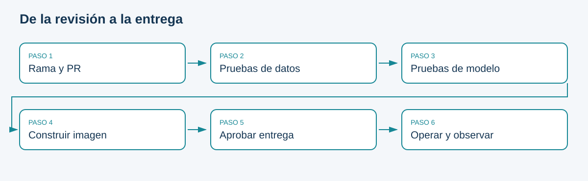

# CI, entrega continua, despliegue y entrenamiento

## Separar responsabilidades

Integración continua ejecuta verificaciones al integrar cambios pequeños. Entrega continua produce un artefacto desplegable y conserva una decisión explícita de liberación. Despliegue continuo automatiza también la liberación cuando pasan los controles. Entrenamiento continuo genera candidatos cuando se activan condiciones de datos o calendario.

Un pipeline verde no prueba que el modelo sea útil: solo que pasó los controles implementados. Un entrenamiento exitoso tampoco implica autorización para servir el resultado. Por eso el workflow de candidato termina guardando evidencia, sin promover automáticamente.

```{mermaid}
flowchart LR
 A[Rama y PR] --> B[Pruebas de datos y código]
 B --> C[Build y smoke test]
 C --> D[Artefacto entregable]
 D --> E[Revisión de liberación]
 E --> F[Despliegue local]
 F --> G[Monitoreo]
 G --> H[Candidato]
 H --> E
```

## Qué versionar
Código, contratos, configuración, definición del dashboard, reglas de alerta y workflows son texto revisable. El pequeño snapshot docente se conserva con checksum para que CI no dependa de UCI. En grandes volúmenes, usar almacenamiento de objetos y manifiestos o herramientas de versionado de datos; no añadir gigabytes al historial Git.

## Diseño de una revisión
Cada PR describe problema, cambio, evidencia y limitaciones. Las pruebas rápidas fallan antes del build costoso. Integrar cambios pequeños facilita revertir. La definición de terminado exige que otra persona reproduzca el README, no solo que el autor muestre una captura.

La solución entrega la imagen como artefacto de Actions después de integrar en `main`. El entorno local recibe y ejecuta el artefacto mediante un paso explícito. Un runner alojado en GitHub no controla el Docker de la computadora del estudiante.

**Ejercicio:** clasifique descargar datos nuevos, validar esquema, entrenar, construir imagen, aprobar y reiniciar el servicio dentro de CI, entrega, despliegue o entrenamiento. Algunas acciones pueden aparecer en más de un flujo; justifique su ubicación.

## Esquema de consulta



Fuente: elaboración propia.

<!-- MANUAL AVANZADO -->

## Tres objetos que evolucionan a velocidades diferentes

En software convencional se suele pensar en una revisión de código que produce un ejecutable. En ML también cambian datos y parámetros aprendidos. El mismo código puede producir un modelo distinto con otro snapshot, y el mismo modelo puede comportarse de manera distinta sobre otra población. El pipeline debe conservar vínculos entre esas tres dimensiones para que una liberación tenga identidad suficiente.

Una imagen de API sin un modelo identificado no describe completamente el comportamiento del sistema. Un modelo sin preprocesamiento y dependencias tampoco es un entregable autosuficiente. El laboratorio simplifica la distribución entrenando el baseline durante el build de la imagen; esa elección permite iniciar un servicio funcional, pero acopla compilación y entrenamiento. En una arquitectura mayor podrían construirse por separado una imagen de servicio y un artefacto de modelo, vinculados por un manifiesto de liberación.

La separación reduce reconstrucciones innecesarias, aunque introduce una comprobación de compatibilidad entre imagen y modelo. No se trata de escoger una arquitectura por moda: el diseño debe permitir saber qué conjunto exacto se despliega y cómo se recupera. Para el módulo se conserva el build existente y se estudia la alternativa como evolución, sin añadir un registro cloud obligatorio.

## Diseñar el grafo según dependencias y costo de fallo

Una secuencia razonable valida primero lo barato y determinista: sintaxis, contrato del snapshot, pruebas unitarias y de integración pequeñas. Solo después construye la imagen y verifica arranque. Si una columna requerida falta, descubrirlo tras veinte minutos de build desperdicia recursos y retrasa retroalimentación. El orden de jobs refleja dependencias reales, no únicamente una lista estética de etapas.

Algunas comprobaciones pueden ejecutarse en paralelo, como documentación y pruebas de contrato, si no comparten estado mutable ni dependen de resultados de la otra. Entrenar y promover en paralelo sería diferente: la promoción necesita un candidato válido y una evaluación terminada. Un grafo explícito evita liberar un artefacto antes de que concluyan sus controles.

La condición de éxito debe representar resultados verificables. Un comando que genera un archivo vacío y retorna cero puede hacer que el siguiente paso parezca exitoso. Por eso los controles revisan contenido, tamaños o contratos mínimos, además del código de salida. En la actividad, `compileall` demuestra que Python puede compilar fuentes; no demuestra que el gate rechace candidatos peores ni que la API cargue un modelo.

## Contrato de entrada y salida de cada etapa

| Etapa | Entrada identificada | Salida útil | Fallo que debe detener el flujo |
|---|---|---|---|
| Validación | Snapshot y manifiesto | Contrato satisfecho | Huella o esquema incorrectos |
| Pruebas | Código, entorno y fixtures | Resultados y diagnósticos | Invariante roto |
| Entrenamiento | Datos y configuración | Modelo con metadatos | Datos inválidos o ajuste incompleto |
| Evaluación | Candidato, vigente y validación | Comparación explícita | Evidencia ausente o incompatible |
| Build | Dockerfile y dependencias | Imagen identificada | Instalación o construcción fallida |
| Smoke test | Imagen concreta | Servicio listo y verificable | No inicia o no carga modelo |
| Entrega | Artefacto aprobado técnicamente | Archivo o imagen disponible | Integridad o publicación fallida |

Un candidato no elegible puede ser una salida válida de evaluación y detener la promoción sin que el entrenamiento se considere averiado. Conviene conservar esa diferencia en los reportes. Un error de lectura del modelo, en cambio, impide evaluar y no debe transformarse en un rechazo estadístico inventado. Las categorías de resultado guían reintentos y responsabilidades.

## Caché, artefacto y registro

La caché acelera pasos repetidos y puede perderse sin afectar la corrección del procedimiento. Un artefacto conserva una salida de ejecución para revisión o transporte. Un registro de modelos añade identidad, búsqueda, políticas y ciclo de vida. Guardar un archivo en la caché y tratarlo como modelo aprobado mezcla garantías distintas.

Una clave de caché de dependencias debe depender del lock y del entorno relevante. Si solo usa el nombre de la rama, un cambio de biblioteca puede reutilizar un entorno incompatible. Aun con clave correcta, la instalación debe poder reconstruir lo necesario cuando la caché falta. Un pipeline que funciona únicamente con la caché anterior no es reproducible desde cero.

El starter conserva una imagen comprimida como artefacto en pushes a main, con retención limitada. No la publica en un registro externo ni la ejecuta automáticamente en el computador del estudiante. Descargar y arrancar ese entregable es una operación posterior. El identificador de ejecución permite localizar su evidencia mientras exista; una política institucional de retención debería corresponder al periodo real de revisión.

## El build también tiene supuestos

El Dockerfile fija una imagen base por digest y usa `poetry.lock` para dependencias de aplicación. Eso reduce cambios inesperados de contenido respecto de usar etiquetas flotantes. No congela toda condición externa para siempre: el entorno debe seguir pudiendo obtener imágenes y paquetes, y las actualizaciones de seguridad requieren decisiones deliberadas. Reproducibilidad y mantenimiento necesitan coexistir.

La imagen copia código y datos, instala dependencias principales y ejecuta un baseline antes de iniciar con un usuario sin privilegios. Los volúmenes de ejecución pueden conservar modelos y reportes más allá de la vida del contenedor. Cambiar la imagen no borra automáticamente esos volúmenes; una reproducción debe explicar si usa almacenamiento nuevo o existente. [Prácticas de construcción de Docker](https://docs.docker.com/build/building/best-practices/).

El smoke test del workflow espera readiness y consulta el endpoint. Eso demuestra carga inicial, pero no sustituye una prueba de predicción válida, de contrato o de recuperación. Las pruebas del paquete cubren otras partes del comportamiento. Una estrategia completa combina capas y reconoce qué riesgos quedan fuera de cada una.

## Revisión de cambios y fronteras de confianza

Un PR debería explicar el problema observable, el comportamiento después del cambio y cómo se comprobó. Para ML, añadir datos o cambiar un umbral merece revisión aunque no haya una modificación grande del estimador. Una diferencia pequeña de YAML puede eliminar todas las pruebas; una gran carpeta de notebooks puede no afectar el servicio. El tamaño del diff no mide por sí mismo el riesgo.

El código de un PR es contenido que se ejecutará en un runner. Los permisos deben limitarse a lo necesario y las credenciales de despliegue no deberían quedar disponibles para código no confiable. En el laboratorio no se necesitan secretos cloud. Un diseño institucional con registros privados debería separar verificación de contribuciones y liberación autorizada, con controles adecuados al origen del cambio.

La protección de una rama puede exigir checks y revisión, pero esos checks solo son útiles si verifican propiedades relevantes. Un check de libro verde prueba que se compila documentación. No prueba calidad predictiva ni operación de la API. Esta distinción es especialmente importante porque el repositorio del curso ya tiene un workflow real de GitHub Pages mientras los workflows de ML se distribuyen dentro del proyecto inicial.

## Anti-patrones para reconocer en una revisión

Entrenar en cada PR con todo el dataset y ajustar tolerancias para que pase produce retroalimentación costosa y puede contaminar evaluación. Publicar un candidato antes de terminar las pruebas crea una ventana de exposición innecesaria. Ignorar errores con `|| true` en pasos críticos permite éxito aparente; usarlo para obtener logs de un contenedor que quizá no existe es otro contexto, donde el diagnóstico no debe ocultar el fallo principal.

Conservar secretos en variables impresas, descargar siempre el CSV remoto durante pruebas o reutilizar un nombre de modelo mutable dificulta reproducir y auditar. La solución no consiste en añadir más pasos indiscriminadamente, sino en asignar a cada control un riesgo y una evidencia. Si nadie puede explicar qué falla detecta un paso, conviene revisar su valor.

```{admonition} Ejercicio de diseño
:class: dropdown
Un pipeline tarda quince minutos y suele fallar por una columna faltante al final. Reordene sus controles, explique qué puede ejecutarse en paralelo y defina qué artefactos conservaría cuando falle. La respuesta debe mantener las dependencias de promoción y evitar que la captura de logs cambie un fallo en éxito.
```

El producto de CI/CD es una cadena de confianza operacional limitada por sus controles. Su valor se demuestra cuando un cambio incorrecto se bloquea temprano y cuando un cambio correcto puede seguirse hasta el estado servido.
