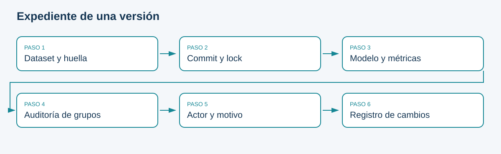

# Auditoría, documentación y control de calidad

## Gobierno del modelo

Gobernanza es definir quién decide, con qué evidencia y bajo qué límites. Un directorio con versiones es útil, pero no constituye por sí mismo gobierno. La model card debe explicar propósito, población, exclusiones, métricas, riesgos, responsables y condiciones de retiro.

El registro de acciones guarda actor, motivo, fecha UTC y versión. El historial Git registra cambios de código; los manifiestos describen datos; los reportes documentan resultados. La cadena solo es útil si los identificadores se conectan. Una captura aislada no permite repetir la evaluación.

## Control de calidad antes de liberar
Confirmar esquema de datos, integridad del artefacto, compatibilidad de features y entorno. Revisar comportamiento de error y readiness. Verificar que el README contiene comandos desde un checkout limpio. Confirmar que los umbrales se fijaron sin usar la prueba final para elegirlos.

```{mermaid}
flowchart TD
 A[Datos y manifiesto] --> D[Expediente de versión]
 B[Commit y dependencias] --> D
 C[Métricas y análisis de grupos] --> D
 D --> E[Revisor]
 E --> F[Decisión documentada]
 F --> G[Operación y seguimiento]
```

## Retención y minimización
La API conserva identificador, probabilidad, decisión y versión, no el payload personal. Para evaluar drift real haría falta una captura de features con reglas de acceso y retención; el laboratorio usa lotes separados y no afirma monitoreo continuo de todas las entradas de la API. Esa separación se declara para no confundir demostración con plataforma completa.

La auditoría por edad utiliza el dataset offline. Para datos nuevos se necesitaría una unión autorizada con atributos de auditoría. No añadirlos a logs o etiquetas Prometheus por comodidad.

## Incidente y aprendizaje
Un informe breve incluye detección, impacto, línea de tiempo, causa probable, mitigación, evidencia de recuperación y acción preventiva con responsable. Evitar culpar a una persona como sustituto de analizar el sistema. Separar hechos observados de hipótesis.

**Ejercicio:** complete la model card con valores realmente obtenidos. Donde falte evidencia, escriba la limitación y cómo la reuniría, en lugar de afirmar cumplimiento.

## Esquema de consulta



Fuente: elaboración propia.

<!-- MANUAL AVANZADO -->

## Gobernar decisiones, no solo almacenar documentos

La gobernanza define quién puede decidir sobre datos, modelos y operación, con qué evidencia y bajo qué restricciones. Un repositorio ordenado ayuda, pero no establece por sí mismo responsabilidades. Una model card sin revisión ni conexión con una versión activa puede convertirse en documentación decorativa. El objetivo es que las decisiones importantes sean comprensibles y puedan revisarse después.

En el laboratorio existen tres funciones: quien implementa, quien revisa y quien opera. Los equipos de tres integrantes rotan esos roles, de manera que cada persona practique producir evidencia y cuestionarla. Esto no equivale a una separación formal de funciones en una organización grande, pero permite observar conflictos: la persona que invirtió tiempo en entrenar puede sentirse inclinada a promover aunque la evidencia no lo justifique.

La gobernanza debe dar una salida válida a «no actualizar». Si solo se premian nuevos despliegues, se incentiva minimizar incertidumbres o escoger métricas favorables. En la actividad, rechazar correctamente el bosque puede ser una decisión sólida. El criterio es la calidad del razonamiento y la protección del sistema, no el número de versiones creadas.

## Un mapa de decisiones del ciclo de vida

| Decisión | Responsable funcional | Evidencia a revisar |
|---|---|---|
| Incorporar una fuente | Responsable de datos | Procedencia, significado, calidad y uso permitido |
| Definir el resultado Y | Dominio y datos | Cómo se observa, retrasos y cambios de criterio |
| Elegir objetivo de evaluación | Dominio y modelado | Errores relevantes, capacidad y grupos |
| Aprobar candidato | Revisión designada | Comparación, incertidumbre, riesgos y compatibilidad |
| Activar o revertir | Operación | Versión, salud, criterio de parada y recuperación |
| Retirar el modelo | Responsables del servicio | Fin de propósito, desempeño o cambios de contexto |

Los nombres funcionales no exigen contratar seis personas. En una institución pequeña pueden coincidir, pero debe quedar explícito quién asume cada responsabilidad. También hay que prever qué ocurre cuando no está disponible quien aprueba o cuando el incidente exige actuar antes de una reunión. Una política de emergencia define autoridad y revisión posterior, en lugar de improvisar acceso durante la caída.

## Model card como argumento verificable

La ficha del modelo debe identificar propósito, población prevista, exclusiones, datos, procedimiento de evaluación, métricas y límites. Para este caso debe decir que se estudia clasificación histórica de suscripción y no una decisión real sobre crédito. El mismo dataset puede contener variables financieras sin que ello autorice extrapolar a otros usos. Un cambio de propósito requiere otra evaluación.

Las afirmaciones deben apuntar a evidencia concreta. «El modelo funciona bien» no identifica población ni métrica; «se evaluó esta versión sobre esta partición con estos resultados y estas limitaciones» permite revisión. Una afirmación de equidad requiere grupos, denominadores, definiciones y análisis contextual. Excluir edad del estimador no elimina la necesidad de evaluar efectos asociados con edad.

El marco de Model Cards organiza información para comunicar usos y evaluación; no es una certificación automática. La ficha del dataset complementa ese documento al describir composición y recolección. En el material, el manifiesto declara una copia CSV local normalizada, sin afirmar verificación binaria del ZIP original de UCI. Esa precisión es preferible a una procedencia más impresionante pero no comprobada. [Model Cards](https://arxiv.org/abs/1810.03993) y [Datasheets](https://arxiv.org/abs/1803.09010).

## Registro de riesgos con acciones

Un riesgo combina una condición posible, su consecuencia y la capacidad de detectarla o mitigarlo. «Hay sesgo» es demasiado general para gestionar. Una formulación útil sería: «las etiquetas tardías están subrepresentadas en la evaluación semanal; esto puede sobreestimar desempeño de la cohorte reciente; se informará cobertura por antigüedad y se esperará maduración antes de promover».

Un registro mínimo incluye riesgo, evidencia actual, probabilidad o plausibilidad argumentada, impacto, responsable, mitigación y estado. Las escalas cualitativas deben tener definiciones para evitar que «alto» signifique algo distinto para cada integrante. Si no hay datos para estimar frecuencia, se declara incertidumbre en lugar de asignar una probabilidad inventada.

| Riesgo del caso | Consecuencia | Control o investigación |
|---|---|---|
| Duration disponible después de la llamada | Evaluación artificialmente optimista | Exclusión y revisión de disponibilidad |
| Etiquetas solo de contactados | Sesgo de selección | Cobertura y límites de generalización |
| Escritura local de auditoría | Manipulación o pérdida posible | Declarar límite y preservar evidencias externas |
| Recall cero con umbral inicial | No recuperar positivos | Estudiar política en validation |
| Versiones distintas en disco y API | Operación inconsistente | Comprobación HTTP tras reinicio |

La mitigación puede reducir un riesgo y aumentar otro. Conservar más datos mejora investigación, pero aumenta exposición y costo. Reducir el umbral recupera positivos y puede incrementar contactos incorrectos. La revisión debe presentar esos intercambios, no describir cada cambio como una mejora sin efectos secundarios.

## Cambios que requieren nueva revisión

Cambiar la definición de Y, incorporar otra población, añadir una fuente o modificar el umbral puede alterar el significado del sistema tanto como cambiar el algoritmo. La revisión debe basarse en el efecto, no en si el diff contiene muchas líneas de Python. Una corrección de documentación que aclara una limitación no requiere el mismo ensayo que una nueva transformación de datos.

Puede distinguirse cambio editorial, corrección compatible, cambio de modelo y cambio de propósito. Cada categoría tiene evidencia proporcional: compilación y enlaces para el primero; pruebas relevantes para el segundo; evaluación y recuperación para el tercero; revisión de datos, uso y responsabilidades para el cuarto. El libro y su workflow de Pages ofrecen un ejemplo real de cambio editorial; no deben presentarse como una liberación del clasificador.

Las decisiones se registran con fecha, versión y motivo. Un comentario de PR puede explicar discusión y alternativas, mientras que el manifiesto conserva la identidad técnica. Ambos deben conectarse. Si la aprobación solo existe en un mensaje informal sin referencia a la versión evaluada, es difícil determinar qué se autorizó realmente.

## Auditoría de una predicción y de una promoción

Para una predicción se comienza por identificador, hora y versión. Se localiza el manifiesto, se verifica artefacto y se revisa qué datos y configuración lo produjeron. El log minimizado no contiene todas las features, por lo que no siempre permite recalcular exactamente la predicción aislada. Esa limitación debe reconocerse al diseñar retención y soporte.

Para una promoción se reconstruye vigente anterior, candidato, comparación, revisión y estado posterior. El actor del JSON es un texto declarado y el archivo no es inviolable. Una auditoría formal requeriría fuentes de identidad y registros protegidos independientes. El laboratorio enseña el contenido de la evidencia y sus vínculos, sin atribuir garantías de autenticidad que no implementa.

Una revisión puede encontrar una decisión técnicamente reproducible y aun así mal justificada. Por ejemplo, el candidato cumplió tolerancias globales, pero un grupo quedó con muy pocos positivos observados para evaluar. La gobernanza hace visible esa incertidumbre y define quién acepta el riesgo o exige datos adicionales. Reproducir un cálculo no equivale a validar su uso.

## Informe de incidente: hechos y explicaciones

Un informe útil separa hechos observados, impacto conocido, hipótesis y acciones. «La API devolvió 503 desde tal hora y cargó la versión anterior después del reinicio» es un hecho verificable. «El problema se debió a falta de memoria» requiere evidencia de recursos o logs; no debería escribirse como causa confirmada solo porque reiniciar funcionó.

La línea de tiempo incluye detección, diagnóstico, mitigación y recuperación. El análisis posterior pregunta qué permitió el fallo, qué controles funcionaron y qué cambio concreto reduciría su repetición. Culpar a una persona sin revisar condiciones del sistema produce pocas mejoras. Tampoco se deben ocultar decisiones humanas: el objetivo es entenderlas dentro del contexto y mejorar el procedimiento.

Las acciones posteriores necesitan responsable y criterio de verificación. «Mejorar monitoreo» es ambiguo; «añadir una comprobación de versión HTTP al runbook y demostrar que detecta divergencia» puede probarse. La actividad conserva el informe de dos o tres páginas; el detalle avanzado del libro sirve como referencia para escribirlo con precisión, no para aumentar su extensión obligatoria.

## Preguntas éticas que las métricas no resuelven

Una buena clasificación no demuestra que el propósito sea adecuado, que todas las personas deban recibir la misma intervención o que la forma de recolectar resultados sea aceptable. La evaluación técnica aporta evidencia, pero la definición de beneficios, daños y responsabilidades requiere contexto y participación de quienes conocen el proceso y sus efectos.

En este caso se evita afirmar causalidad sobre llamadas, declarar equidad por una tabla o generalizar resultados históricos a cualquier población. Esas restricciones no impiden aprender: permiten distinguir lo que se puede calcular de lo que necesita otra investigación. Un profesional debe poder comunicar esa frontera incluso cuando el sistema parece funcionar.

```{admonition} Ejercicio de revisión
:class: dropdown
Redacte una decisión de no promoción en cinco elementos: versión, evidencia, incertidumbre, acción siguiente y responsable. Después revise si alguien ajeno al equipo podría identificar qué falta para reconsiderarla. Si solo dice «no pasa», falta explicación; si dice «es ético», falta especificar qué cuestión se evaluó y con qué límites.
```

La gobernanza se vuelve operativa cuando facilita decisiones consistentes y recuperación de evidencia. Su calidad se observa durante un cambio difícil o un incidente, no únicamente en la existencia de un documento firmado.
