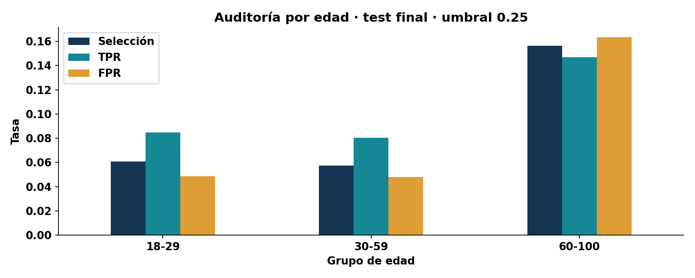

# Sesgos y equidad en modelos desplegados

## Más allá de una métrica global

Un promedio aceptable puede ocultar errores concentrados. El dataset refleja decisiones históricas de contacto, registro y respuesta; no es una muestra neutral de todas las personas. Sesgo de selección, medición y etiquetas puede persistir aunque el algoritmo no use explícitamente edad.

El laboratorio compara grupos de 18–29, 30–59 y 60–100 años. Son segmentos pedagógicos, no una clasificación legal ni una definición universal de grupos protegidos. La selección de grupos en una aplicación real requiere contexto y participación de responsables.

## Qué calcular
Tasa de selección = proporción con decisión positiva. TPR = positivos reales identificados; FPR = negativos reales contactados como positivos. Comparar TPR se relaciona con igualdad de oportunidad; comparar simultáneamente TPR y FPR corresponde a otra exigencia. Paridad de selección puede entrar en tensión con diferencias de prevalencia y calibración.

```python
from bank_ops.monitor import fairness
from bank_ops.config import FEATURES
probability = estimator.predict_proba(test[FEATURES])[:, 1]
rows = fairness(test, probability, threshold=0.25)
```



Se informa n, positivos y negativos junto a las tasas. Si un grupo no tiene positivos, TPR no se define. El indicador `reliable` requiere al menos 30 positivos y 30 negativos como advertencia mínima docente; no constituye un análisis de potencia ni intervalo de confianza. Para decisiones reales, añadir incertidumbre y análisis de intersecciones cuando el volumen lo permita.

## Mitigación y evaluación
Investigar primero cobertura, calidad y disponibilidad de etiquetas. Recolectar datos de grupos subrepresentados puede ser más útil que ajustar un umbral. Cambiar umbrales por grupo tiene implicaciones técnicas y normativas que requieren revisión contextual; no se automatiza aquí. Evaluar si una mitigación mejora una brecha pero perjudica otra métrica o grupo.

**Ejercicio:** elija una diferencia observada, reporte los denominadores, formule dos causas posibles y proponga una comprobación. No use la palabra «justo» como conclusión basada únicamente en una tabla.

<!-- MANUAL AVANZADO -->

## Definir beneficio, daño y población de comparación

Antes de elegir una métrica debe aclararse qué acción produce el sistema. En el ejemplo, una predicción positiva podría priorizar contacto, pero el dataset no contiene un experimento causal que mida el efecto de esa llamada. Un falso positivo puede consumir capacidad y generar contacto no deseado; un falso negativo puede omitir una oportunidad. Su importancia depende del contexto y no se deduce automáticamente de la etiqueta binaria.

La población del dataset son casos observados bajo un proceso histórico de campaña. No representa necesariamente a todas las personas que podrían beneficiarse o verse afectadas por otra política. Comparar grupos dentro de esa muestra informa sobre la muestra; extrapolar a personas nunca contactadas exige supuestos adicionales. El sesgo de selección puede existir antes de entrenar el algoritmo.

Los segmentos de edad del laboratorio son pedagógicos. La función usa intervalos 18–29, 30–59 y 60–100, y reporta grupos vacíos. Si se aplicara a datos con edades fuera de esos límites, habría que revisar cobertura porque quedarían sin asignación en esa definición. Una auditoría debe comprobar cuántas filas entraron a algún grupo; cambiar bins cambia la pregunta y debe registrarse.

## Derivar las tasas desde conteos

Para un grupo g, la tasa de selección es $P(\hat Y=1\mid G=g)$. TPR es $P(\hat Y=1\mid Y=1,G=g)$ y FPR es $P(\hat Y=1\mid Y=0,G=g)$. Precisión por grupo condiciona en la decisión positiva: $P(Y=1\mid\hat Y=1,G=g)$. Sus denominadores son distintos; ninguna tasa debe calcularse mezclando población de otro grupo.

Considere el grupo A con 200 casos, 40 positivos reales, TP=24 y FP=32. El grupo B tiene 800 casos, 80 positivos, TP=48 y FP=72. Ambos tienen TPR 0.60, pero FPR es 0.20 en A y 0.10 en B. La tasa de selección es 56/200=0.28 frente a 120/800=0.15. La precisión es aproximadamente 0.429 frente a 0.40. Decir que «las tasas son iguales» sin nombrar cuál es una afirmación ambigua.

| Cantidad | Grupo A | Grupo B |
|---|---:|---:|
| n | 200 | 800 |
| Positivos reales | 40 | 80 |
| TPR | 0.60 | 0.60 |
| FPR | 0.20 | 0.10 |
| Selección | 0.28 | 0.15 |
| Precisión | 0.429 | 0.40 |

Este ejemplo satisface igualdad de TPR en los valores puntuales, pero no igualdad simultánea de TPR y FPR ni paridad de selección. Tampoco demuestra que los valores poblacionales sean exactamente iguales, porque los conteos tienen incertidumbre. [Definiciones y evaluación de métricas en Fairlearn](https://fairlearn.org/main/user_guide/assessment/common_fairness_metrics.html).

## Por qué algunos criterios entran en tensión

La tasa de selección se descompone como $TPR_g\pi_g+FPR_g(1-\pi_g)$, donde $\pi_g$ es la prevalencia del grupo. Si dos grupos tienen las mismas TPR y FPR pero prevalencias distintas, pueden tener tasas de selección diferentes. Exigir simultáneamente que todas esas cantidades coincidan puede ser incompatible salvo condiciones particulares. El conflicto no se resuelve escogiendo la métrica que produce el menor número de disparidad.

La elección debe relacionarse con el daño que se desea examinar. Si preocupa omitir positivos, interesa TPR; si preocupa una acción incorrecta sobre negativos, interesa FPR; si se analiza distribución de acceso a una acción, interesa selección. Todas necesitan contexto. Una tasa de selección igual podría lograrse generando decisiones aleatorias inútiles; la paridad aislada no prueba calidad ni justicia del sistema.

Las probabilidades añaden calibración por grupo. Un score 0.20 puede no tener el mismo significado empírico en todos los segmentos, incluso cuando el ranking global es bueno. Analizar calibración requiere volumen en intervalos de score y etiquetas representativas. No basta con comparar una media de probabilidad por grupo, porque esa media también refleja mezcla de casos.

## Incertidumbre en grupos pequeños

Una tasa observada sobre cinco positivos es frágil: un único caso cambia TPR en veinte puntos porcentuales. Sobre quinientos positivos, ese caso cambia 0.2 puntos. Mostrar el mismo número de decimales para ambos grupos puede transmitir una precisión inexistente. La función `fairness` devuelve denominadores y una bandera docente `reliable`; esa bandera es una advertencia mínima, no una prueba estadística completa.

El notebook 05 añade intervalos de Wilson para proporciones. Para k éxitos sobre n ensayos, se calcula un centro y semiancho ajustados por $z^2/n$, evitando el intervalo normal ingenuo que puede degenerar cuando la tasa observada es cero o uno. Se usa z≈1.96 como aproximación del 95 % bajo un modelo binomial de observaciones independientes. No se presenta como garantía cuando hay dependencia, selección de casos o múltiples comparaciones.

Un grupo con cero positivos tiene TPR indefinida, no TPR cero. Un grupo con diez positivos y ningún acierto sí tiene TPR observada cero, con incertidumbre sobre la tasa poblacional. La diferencia es esencial: en el primer caso falta el denominador y en el segundo existe evidencia de errores sobre positivos observados.

```python
# Ejemplo autónomo: misma tasa observada, distinta precisión de estimación.
from math import sqrt
def wilson(k, n, z=1.959963984540054):
    if n <= 0:
        return None
    p = k / n
    denominator = 1 + z*z/n
    center = (p + z*z/(2*n)) / denominator
    half = z * sqrt(p*(1-p)/n + z*z/(4*n*n)) / denominator
    return center-half, center+half
print(wilson(3, 5))
print(wilson(300, 500))
```

El primer intervalo es mucho más ancho. Un intervalo individual por grupo tampoco es directamente un intervalo de la diferencia entre grupos. Para estudiar una brecha se necesitaría un procedimiento de comparación explícito, con supuestos y corrección o interpretación adecuada de exploración múltiple.

## Intersecciones y cobertura

Analizar edad y canal por separado puede ocultar que el problema se concentra en una combinación. Las intersecciones permiten detectar esos casos, pero multiplican grupos y reducen tamaños. Un proceso responsable define primero segmentos relevantes para el contexto, presenta conteos y distingue exploración de confirmación. Buscar miles de cortes hasta encontrar una diferencia extrema genera hallazgos que pueden no reproducirse.

Los grupos sin suficientes resultados siguen importando. La respuesta no consiste en eliminarlos del informe para que la tabla sea más limpia, sino en describir qué información falta y qué decisiones quedan limitadas. Puede ser necesario ampliar recolección, cambiar el horizonte de evaluación o restringir una afirmación de desempeño. La ausencia de evidencia no debe representarse como ausencia de riesgo.

La cobertura de etiquetas debe estudiarse por grupo. Si A tiene 90 % de resultados observados y B solo 30 %, una comparación de TPR sobre etiquetados puede no representar la misma etapa de maduración. Una aparente brecha puede combinar calidad del modelo y selección de observación. El notebook 04 ayuda a entender ese mecanismo antes de interpretar la tabla de equidad.

## Evaluar mitigaciones sin borrar intercambios

La primera respuesta puede ser corregir calidad, revisar definición de etiquetas o mejorar representación de datos. Si la medición del resultado es distinta entre grupos, ajustar el algoritmo no arregla automáticamente el problema. Reponderación, cambios de umbral o entrenamiento con restricciones son familias de intervención que necesitan evaluación contextual y evidencia posterior.

Un umbral global distinto modifica selección, TPR y FPR en todos los grupos. Los efectos no serán iguales si sus distribuciones de score difieren. Umbrales por grupo añaden decisiones sensibles sobre trato y objetivos, por lo que el laboratorio no los aplica automáticamente. Se estudian las consecuencias técnicas, sin formular una regla normativa universal ni convertir una métrica en autorización de uso.

La comparación de mitigaciones debe conservar también desempeño global, capacidad y costo. Reducir una brecha de TPR puede aumentar FPR en otro grupo o exceder el presupuesto de contactos. Un informe útil presenta esos cambios conjuntamente y explica qué objetivo prioriza. No se selecciona retrospectivamente la definición de equidad que hace parecer mejor al candidato.

## Comunicar un hallazgo con límites

Una formulación adecuada incluye grupo, métrica, conteos, incertidumbre, población y siguiente comprobación. Por ejemplo: «en esta partición, el grupo A presenta mayor FPR puntual; su denominador es menor y la cobertura de etiquetas difiere, por lo que se revisará maduración antes de atribuir el cambio al modelo». Esa frase es más útil que «el modelo discrimina» o «el modelo es justo» basándose solo en un gráfico.

```{admonition} Caso de estudio opcional
:class: dropdown
Dos grupos tienen TPR 0.60, pero uno contiene cinco positivos y el otro quinientos. Explique por qué no se debe comunicar igualdad demostrada. Luego use la descomposición de selección para mostrar cómo prevalencias diferentes pueden producir tasas de selección distintas aun con las mismas tasas condicionales. La respuesta debe separar identidad algebraica, incertidumbre y juicio contextual.
```

La auditoría de equidad aporta evidencia sobre patrones de beneficio y error. Su valor depende de la calidad de datos, la definición del problema y la interpretación; ninguna biblioteca convierte automáticamente una tabla de tasas en una conclusión ética completa.
